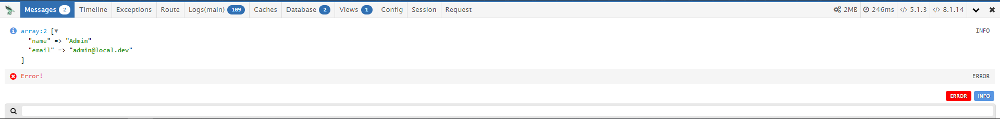

## Phalcon with DebugBar integration

[](http://phalcon.link/discord)
[](https://packagist.org/packages/phalcon/incubator-debugbar)
[](https://packagist.org/packages/phalcon/incubator-debugbar)
[](https://codecov.io/gh/phalcon/incubator-debugbar)
[](https://packagist.org/packages/phalcon/incubator-debugbar/stats)

This is a package to integrate [PHP Debug Bar](http://phpdebugbar.com/) with Phalcon 5.

## Honorable mentions

[maximebf](https://github.com/maximebf/php-debugbar) For the base and his DebugBar  
[snowair](https://github.com/snowair/phalcon-debugbar) Provided the first integration with Phalcon in Version 3  
[nin](https://github.com/ninhnguyen22/phalcon-debugbar) For porting the most parts to Phalcon 5  

### Screenshots



## Issues tracker

https://github.com/phalcon/incubator/issues

## Installation:

Note: Use the DebugBar only in development. It can slow the application down (because it has to gather data). So when experiencing slowness, try disabling some of the collectors.

Require this package with composer. It is recommended to only require the package for development.

```php
composer require phalcon/incubator-debugbar --dev
```

Register a Provider in `index.php`

```php
$container = new \Phalcon\Di\FactoryDefault();

$container->register(
    new \Phalcon\Incubator\Debugbar\ServiceProvider()
);
```

## Usage:

Add Message

```php
use Phalcon\Incubator\Debugbar\Phalcon\Helper\Debugbar;

Debugbar::info($object);
Debugbar::error('Error!');
Debugbar::warning(new \Phalcon\Config\Config(['title' => 'Warning']));
```

Add start/stop timing:

```php
use Phalcon\Incubator\Debugbar\Phalcon\Helper\Debugbar;

Debugbar::startMeasure('function', 'Function runtime');
Debugbar::stopMeasure('function');
Debugbar::measure('function', function() {
    // Do something…
});
```

Add Log Exception:

```php
use Phalcon\Incubator\Debugbar\Phalcon\Helper\Debugbar;

try {
    //  Do something
} catch (\Throwable $exc) {
    Debugbar::addThrowable($exc);
}
```
